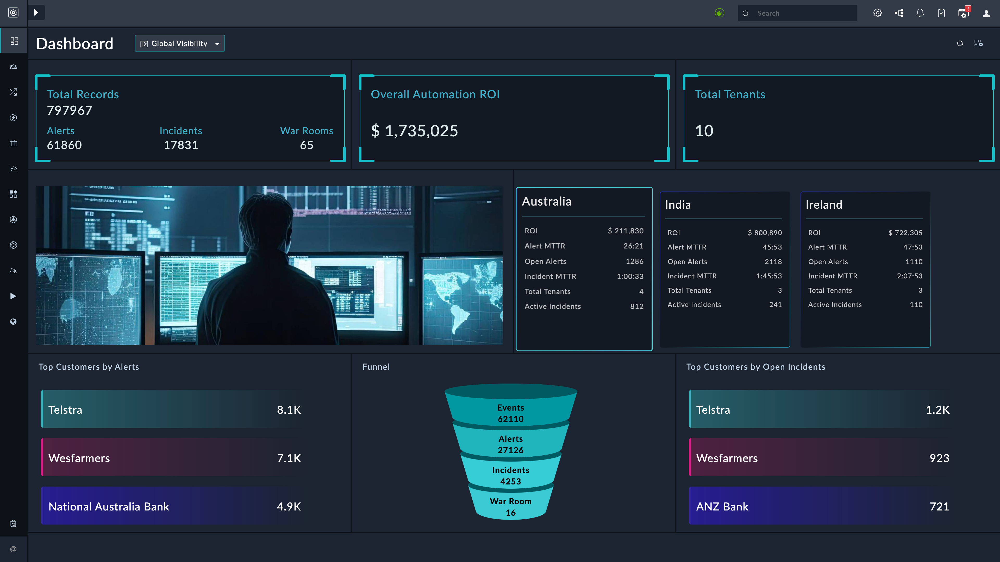

# Release Information 

- **Version**: 1.0.0 
- **Certified**: No 
- **Publisher**: Fortinet 
- **Compatible Version**: 7.3.1 and later 

# Overview 
The **Global Visibility** solution pack offers a user-friendly dashboard for for visualizing and accessing data across multiple FortiSOAR™ instances. 
This streamlined configuration process ensures seamless access to crucial information across various locations, enhancing overall visibility and decision-making capabilities for any SOC.

The **Global Visibility** solution pack simplifies the task of aggregating site-specific data, providing a comprehensive and centralized view for users, and ultimately empowering the users to make informed choices efficiently.

# Next Steps
| [Installation](./docs/setup.md#installation) | [Configuration](./docs/setup.md#configuration) | [Usage](./docs/usage.md) | [Contents](./docs/contents.md) | 
|--------------------------------------------|----------------------------------------------|------------------------|------------------------------|
