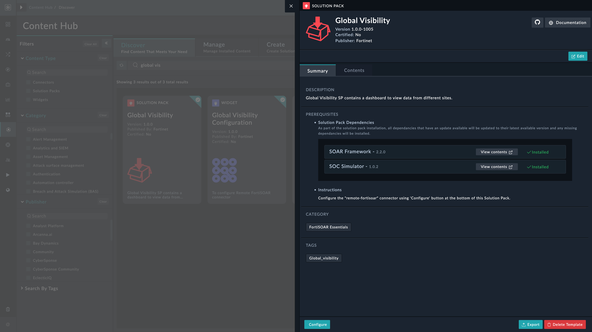
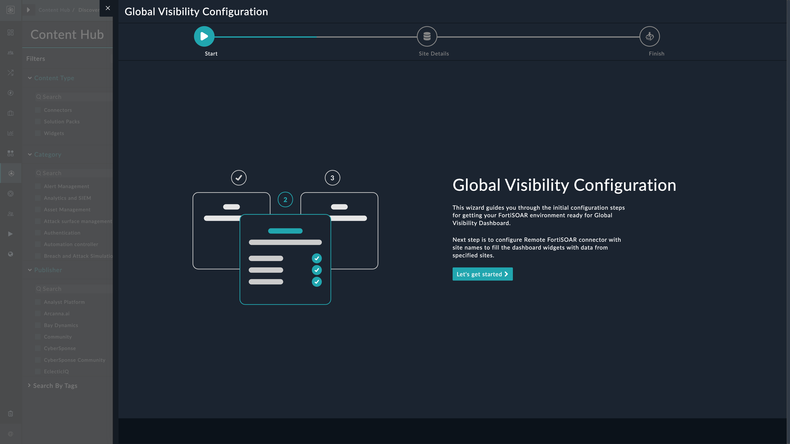
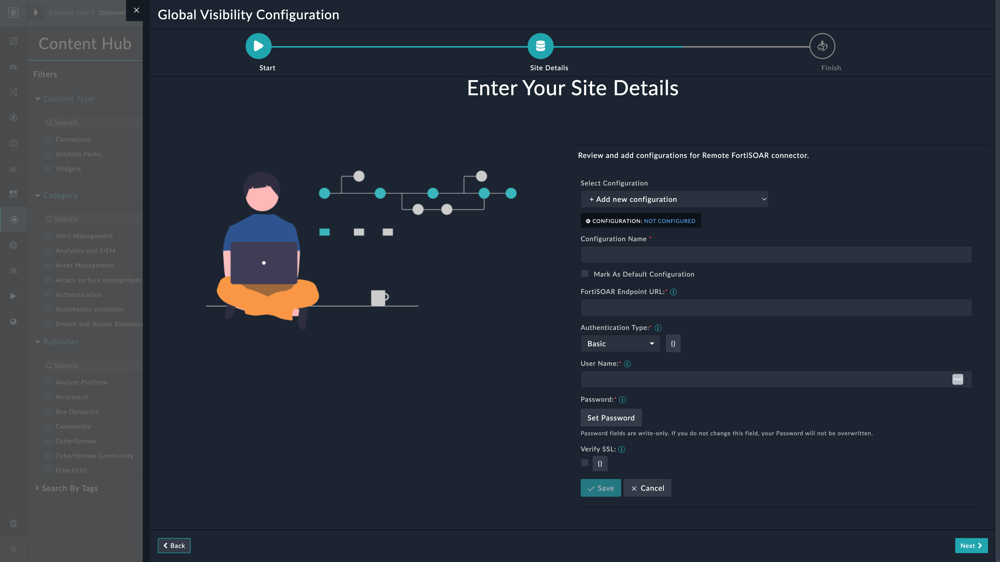

[Home](../README.md) |
|--------------------------------------------|

# Installation

1. To install a solution pack, click **Content Hub** > **Discover**.
2. From the list of solution pack that appears, search for and select **Global Visibility**.
3. Click the **Global Visibility** solution pack card.
4. Click **Install** on the lower part of the screen to begin the installation.

## Prerequisites
The **Global Visibility** solution pack depends on the following solution packs that are installed automatically &ndash; if not already installed.

| Solution Pack Name | Version         | Purpose                                       |
|:-------------------|:----------------|:----------------------------------------------|
| SOAR Framework     | v2.0.1 or later | Required for Alerts, Assets, Incident modules |
| SOC Simulator      | v1.0.2 or later | Required for the Scenario module to generate example scenarios |

Before installing the FortiSOAR Global Visibility Solution Pack, ensure the following prerequisites are met:

1. A working FortiSOAR™ instance at each site
2. Access to the FortiSOAR™ API of each instance
3. User credentials with appropriate permissions to access data using API
4. Remote FortiSOAR connector for Global Visibility data aggregation

# Configuration

## Install and Configure Connectors
Install and configure the following connector:

- **Remote FortiSOAR** - This connector facilitates automated interactions, with a FortiSOAR™ endpoint using FortiSOAR™ APIs. To configure and use the Remote FortiSOAR connector, refer to [Configuring Remote FortiSOAR](https://docs.fortinet.com/fortisoar/connectors/remotefsr)

## Setup Global Visibility on FortiSOAR™
After installation of the **Global Visibility** solution pack, run the configuration wizard to prepare your FortiSOAR™ environments to reterive information from other FortiSOAR™ sites.
1. Log in to FortiSOAR™, after [installation](#installation) completes.

2. Click the button **Configure** from the lower-left of the screen.

    

3. Click the button **Let's get started** on the Global Visibility configuration page.

    

4. Configure Remote FortiSOAR connector. Add multiple connector configurations to retrieve information from multiple sites and click **Next**.

    

6. Click **Finish** to complete the configuration process.
   
    

# Next Steps
| [Usage](./usage.md) | [Contents](./contents.md) |
|---------------------|---------------------------|
