| [Home](../README.md) |
|----------------------|

# Usage

Global Visibility Solution pack helps user to visualize data across multiple FortiSOAR instances.

The FortiSOAR Global Visibility Solution Pack provides a comprehensive set of tools to manage and visualize data from multiple FortiSOAR instances across different sites.

This solution pack enables users to monitor alerts, incidents, and other critical data in a centralized dashboard, streamlining security operations and enhancing decision-making.

## Global Visibility Records Scenario
Refer to [Simulate Scenario documentation](https://github.com/fortinet-fortisoar/solution-pack-soc-simulator/blob/develop/docs/usage.md) to understand how to simulate and reset scenarios.
To understand and visualize the Global Visibility Dashboard, we have included a scenario &mdash; **Global Visibility Records** with this solution pack. 

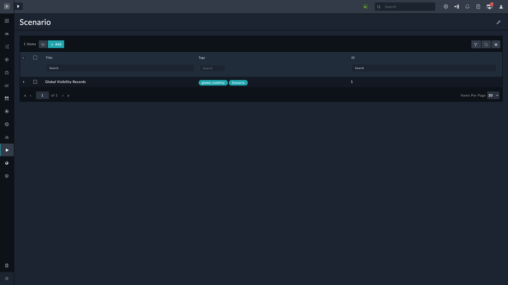
    
This scenario generates an example records of type *Global Visibility Data* as mentioned below and these records help populate the dashboard with mock data;
 - Three Master records for the 'Record Summary Card' widget, which represents individual site.
 - One Global record for the 'Record Summary Tile' widget, which represents various count of records across all sites.

Once scenario is executed, mock records will created and it will look like below;
    
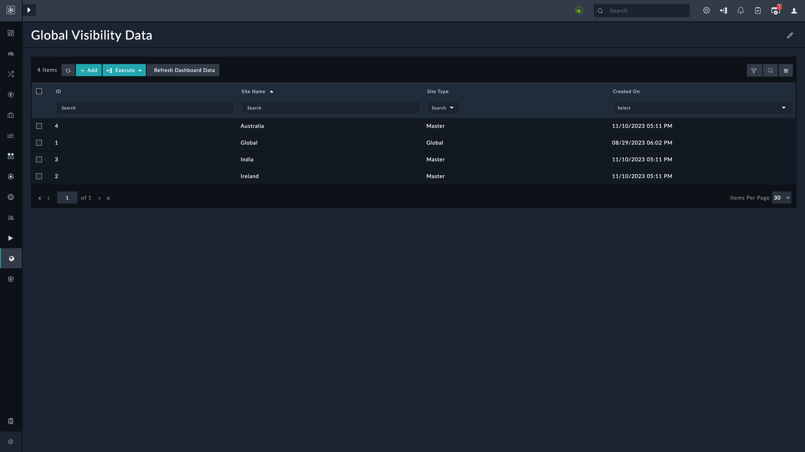
 

## Dashboard
This section continues to describe the dashboard and remaining widgets in the FortiSOAR Global Visibility Solution Pack, along with their functionalities, interactions, and best practices.

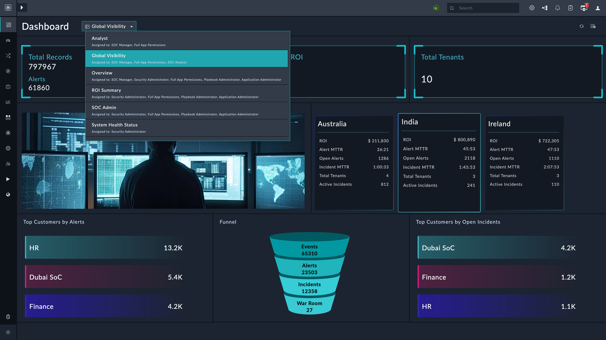

### Global Visibility Dashboard Edit View
This section describes the edit view of FortiSOAR Global Visibility Dashboard. You can visualize different widgets added and configured in this dashboard.

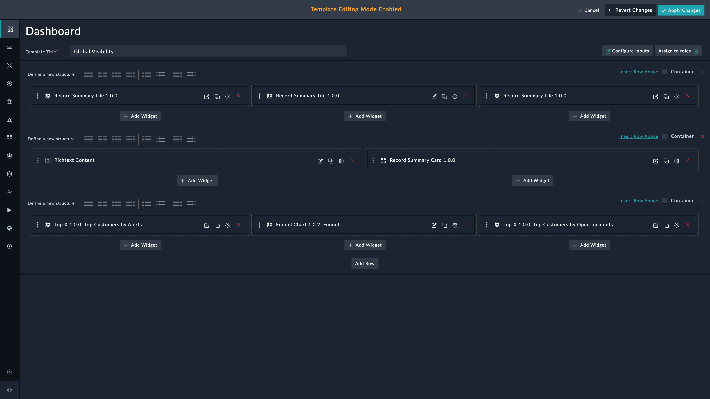

### Record Summary Tile
The Record Summary Tile widget offers a more detailed breakdown of record metrics for all sites combined. It complements the Record Summary Card by providing a compact visualization of metrics such as Total Alerts, Total Indicators, Total Tenants.

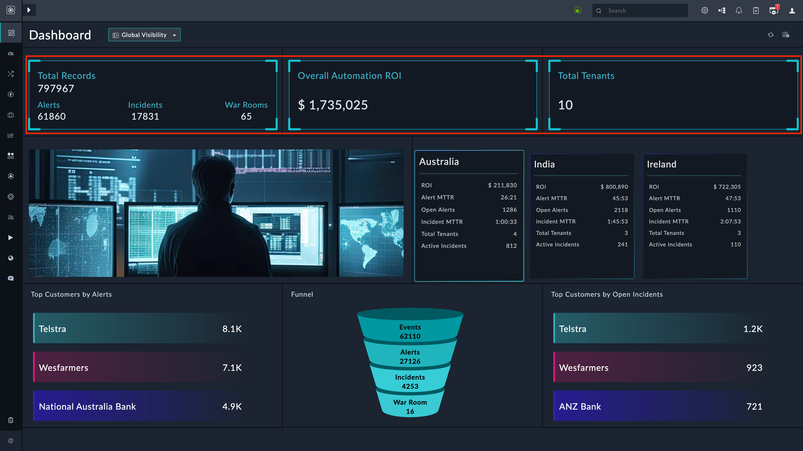

### Record Summary Card
As described earlier, the Record Summary Card widget provides an overview of record metrics for each site. Additionally, it has the unique ability to broadcast an event when clicked. This event triggers data updates in other widgets.

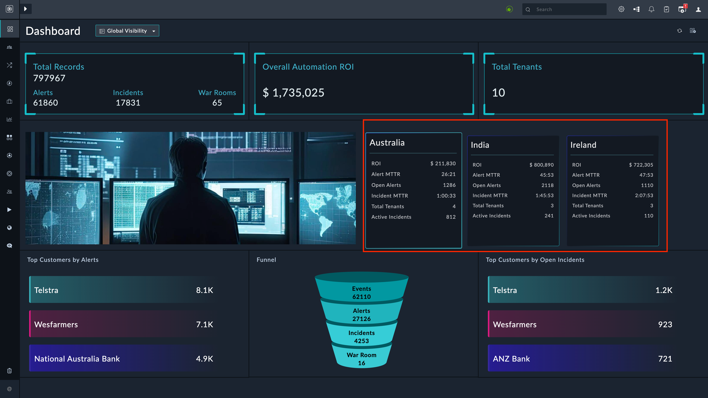

#### Broadcast Event
When a user clicks on a Record Summary Card representing a site, the widget broadcasts an event containing information about the selected site. This event serves as a trigger for other widgets to adjust their displayed data according to the selected site.

### Funnel Chart
The Funnel Chart widget visualizes the progression of records through various stages of the workflow. It's an excellent tool for understanding the efficiency of your incident response process.

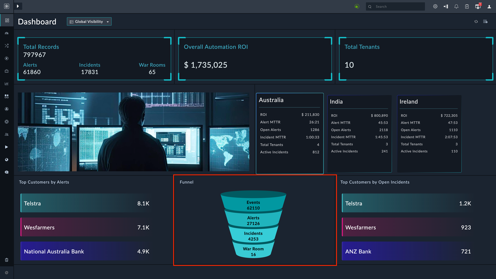

#### Event Listening

The Funnel Chart widget listens for the broadcasted event triggered by the Record Summary Card. When the event is received, the Funnel Chart updates to show the funnel for the selected site.

### Top-X
The Top-X widget identifies the top records based on specific criteria, such as highest priority or most recent. It helps users focus on critical records and analyze trends across sites.

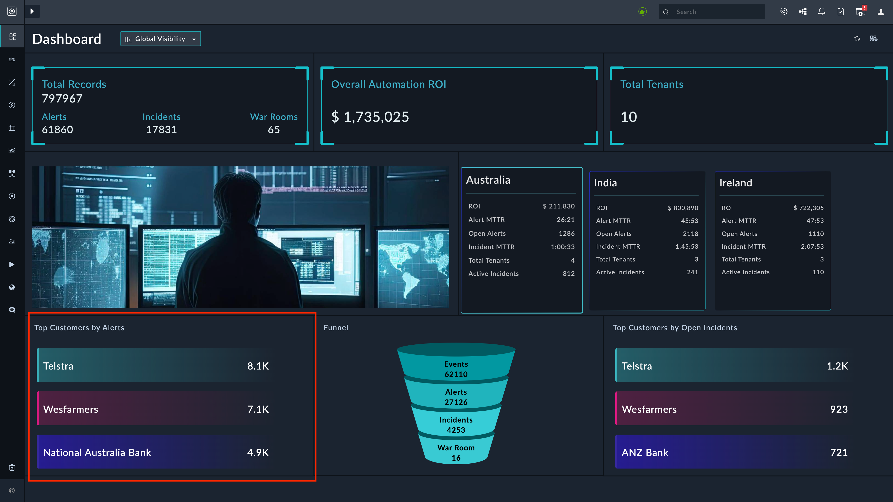

#### Event Listening

Similar to the Funnel Chart, the Top-X widget also listens for the broadcasted event from the Record Summary Card. When the event is detected, the Top-X widget adjusts its data to reflect the selected site.

### Richtext Content
The Richtext Content widget allows users to display images or diagrams that are relevant to the selected site. This visual aid can provide contextual information and enhance the decision-making process. User can change an image of their choice by modifying `img src` html tag by editing this widget settings.

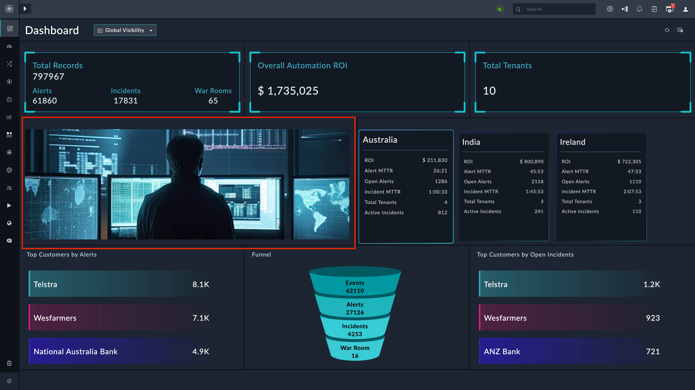

## Event-Driven Interaction

1. Click on a Record Summary Card to select a site.
2. The selected site triggers a broadcasted event.
3. The Funnel Chart and Top-X widgets respond to the event, updating their data to reflect the selected site's metrics.

## Global Visibility: The Playbook Collection

- The *Global Visibility* playbook collection is automatically triggered when the FortiSOAR Global Visibility Solution Pack is configured for the specified sites. Upon activation, the playbooks within the collection initiate data collection processes from each site's FortiSOAR instance.

- These playbooks execute a series of tasks to gather data from individual sites. This data includes alerts, incidents, tasks, and other relevant information. Once collected, the playbooks transform the data into a standardized format and populate the **Global Visibility** module.

The primary purpose of the *Global Visibility* playbook collection is to gather data from individual sites and transform it into a format that is easily consumable by the widgets. By centralizing data within the "Global Visibility" module, the solution pack's widgets can efficiently retrieve and display information, providing users with a unified view of critical metrics and records across sites.

## Global Visibility Data: The Module

The **Global Visibility** module acts as a centralized repository for the aggregated data. It ensures that the widgets have access to a consistent and up-to-date dataset for visualization. The module provides an interface through which widgets can query and retrieve data based on the selected site or other relevant parameters.

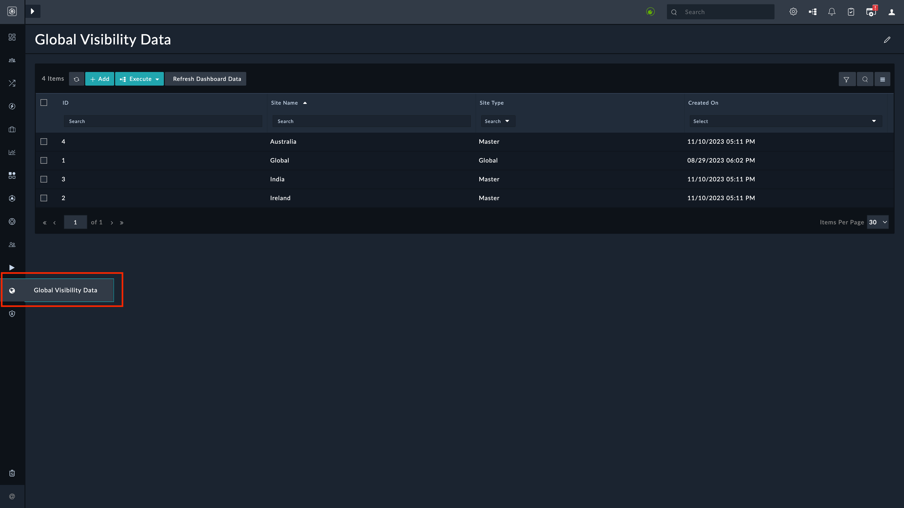

## Global Visibility: The Widgets

The widgets within the solution pack's dashboard, such as the Record Summary Card, Record Summary Tile, Funnel Chart, Top-X, rely on the "Global Visibility" module as their primary data source. The playbooks' data collection and transformation process directly influences the accuracy and comprehensiveness of data displayed by these widgets.

## Global Visibility: The Solution Pack

The "Global Visibility" playbook collection plays a pivotal role in the FortiSOAR Global Visibility Solution Pack by aggregating, centralizing, and transforming data from individual sites into a unified dataset. This dataset is harnessed by the solution pack's widgets to provide users with insightful and consolidated visualizations of alerts, incidents, tasks, and other critical metrics across multiple FortiSOAR instances. The "Global Visibility" module acts as the foundation for enhancing decision-making and security operations efficiency.

### Delete Stale Data Playbook
This playbook syncs records with the sites configured in Remote FortiSOAR Connector and deletes records from Global Visibility Data module whose respective Site's configuration is either deleted or health check is unavailable.

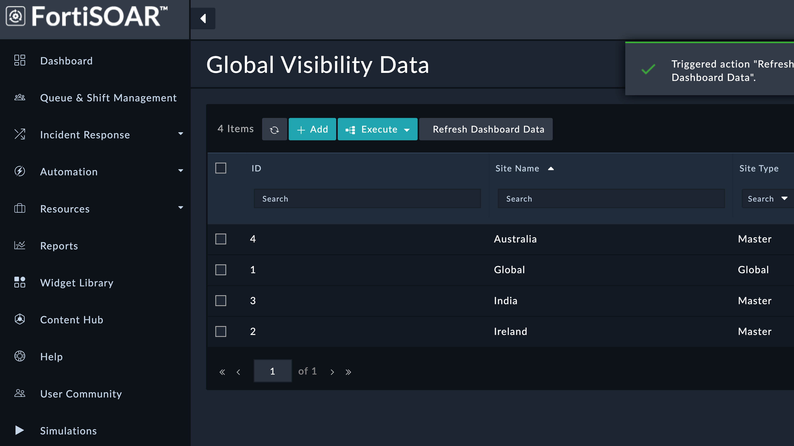

### Refresh Dashboard Data Playbook
This playbook syncs records with the sites configured in Remote FortiSOAR Connector and creates/updates records for sites based on Remote FortiSOAR connector configured.

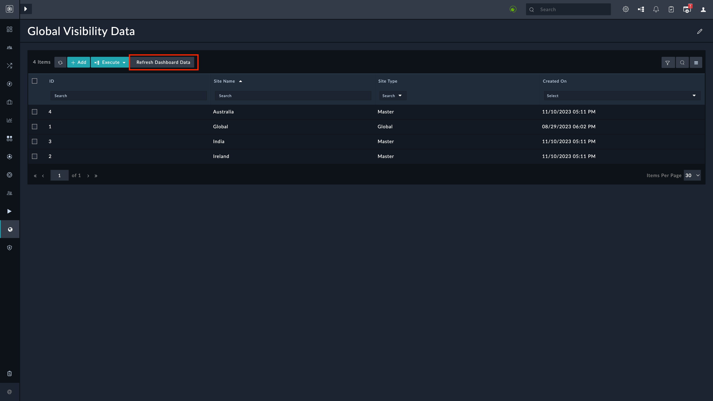

# Next Steps

| [Installation](./setup.md#installation) | [Configuration](./setup.md#configuration) | [Contents](./contents.md) |
|-----------------------------------------|-------------------------------------------|---------------------------|
